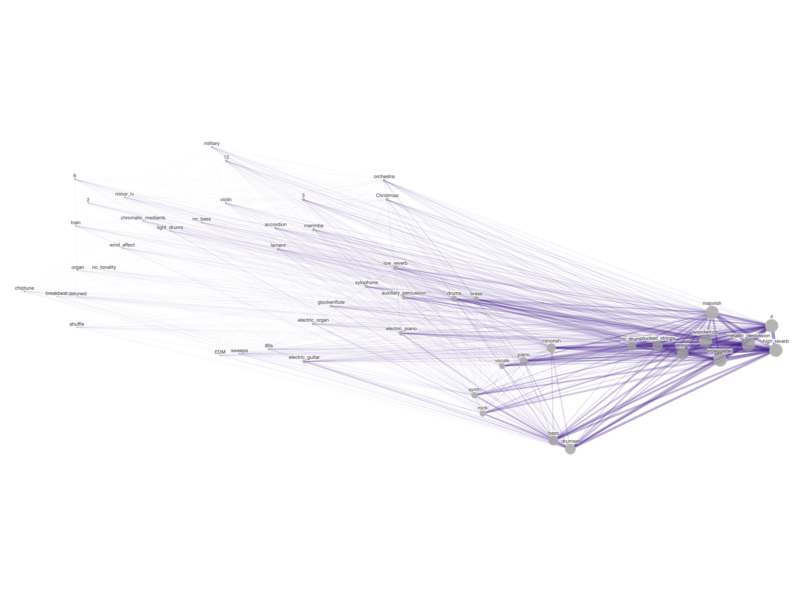

# The Common Cold: Using Data Science to Define the Winter Topic in Video Game Music

## Authors

Megan L. Lavengood, George Mason University

Evan Williams, Digital Science

## Description

This Dash app to help us explore and analyze the data we collected, using Dash Cytoscape to visualize a two-dimensional representation of the relationships between different musical characteristics found in winter video game tracks. The coordinates are calculated using scikit-learn's implementation of tSNE. 

Controls to filter the dataset are available under Data Controls, including selecting tracks by publisher, platform, franchise, and year. Controls do adjust hyperparameters for t-SNE and the network graph are available under Hyperparameter Controls.

